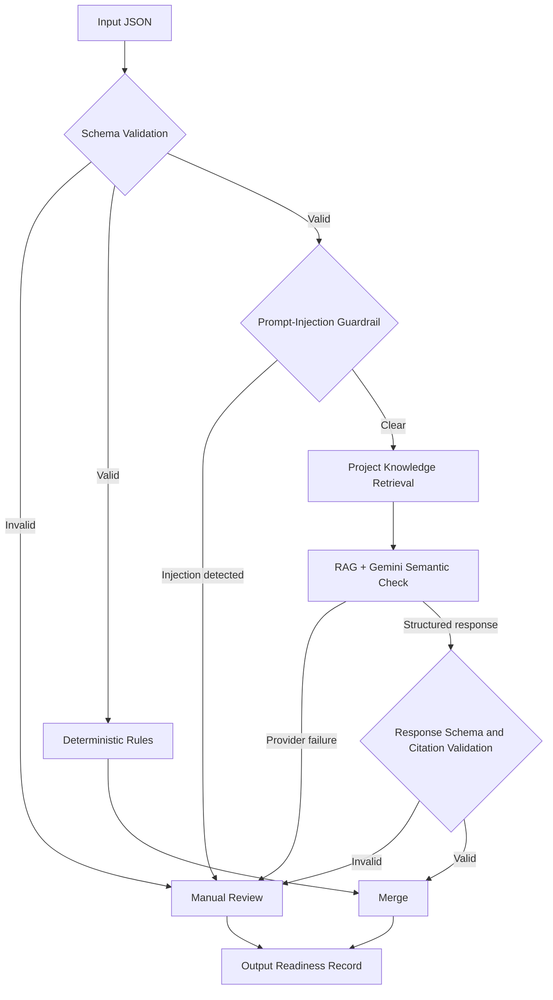

# Product Documentation

This file gives an assessor a single view of the product definition and the
evidence reported elsewhere in the repository. The system is a coursework
prototype. Its knowledge base is project-defined and is not real bank policy.

## Demo

[Watch the 5-minute recorded demonstration](https://youtu.be/OK3kQrdC20Q) - face and screen recording covering the project boundary, architecture, live Streamlit interface, evaluation metrics, controls, and limitations.

## Persona and problem

The primary user is a Credit Operations Officer who pre-checks microloan
applications before formal credit assessment. The persona handles about 40-60
applications per day; this is a scenario assumption, not a measured bank
statistic. The problem is to make missing documents, exact numeric conflicts,
and semantic contradictions visible before the application proceeds.

The system does not assess affordability, score credit, approve or reject a
loan, set an interest rate or limit, contact customers, or use external credit
data. A human remains responsible for every downstream credit decision.

## Input

The application parser accepts one JSON object with exactly the project
application fields below. Evaluation labels and split metadata are stored
separately and are not parsed as application evidence.

| Field | Type | Meaning |
|---|---|---|
| `application_id` | non-empty string | Application identifier |
| `declared_monthly_income` | number or null | Applicant-declared monthly income |
| `income_proof_monthly_income` | number or null | Monthly income derived from proof |
| `bank_statement_average_monthly_inflow` | number or null | Average monthly bank inflow |
| `requested_loan_amount` | number or null | Requested principal |
| `existing_monthly_liabilities` | number or null | Existing monthly liabilities |
| `loan_purpose_category` | category or null | One of the seven project purpose categories |
| `loan_purpose_text` | string or null | Applicant's free-text purpose explanation |
| `identity_proof_present` | boolean | Whether identity proof is present |
| `income_proof_present` | boolean | Whether income proof is present |
| `bank_statement_present` | boolean | Whether bank statements are present |

The allowed purpose categories are `MEDICAL_EXPENSE`, `EDUCATION`,
`HOME_REPAIR`, `SMALL_BUSINESS`, `VEHICLE`, `DEBT_CONSOLIDATION`, and
`OTHER`. A complete example is in `data/sample/complete_application.json`.

## Output

The final path returns a JSON-serialisable readiness record containing:

- `application_id`, `system`, `outputs`, and `flag_worthy`;
- the deterministic `rule_result`, including issue codes, reasons, and
  evidence fields;
- the structured `semantic_result` and provider call metadata;
- retrieved chunk identifiers and validated citation identifiers;
- prompt-injection detection status and guardrail findings.

The user-facing `outputs` can contain `Missing Documents`,
`Inconsistent Information`, or `Manual Review`; otherwise it contains only
`Complete`. Provider failure, invalid structured output, or invalid citations
route the case to `Manual Review`. Gemini cannot erase a deterministic issue.

## High-level architecture

The external intelligence layer is Gemini 3.8 Flash, accessed through
`google-genai`. Retrieval is bounded to
`knowledge_base/project_readiness_contract.md` and
`knowledge_base/human_review_contract.md`. It does not index course slides,
evaluation labels, results, or customer data. The system is RAG, not an agent:
it has no planning loop, autonomous tool selection, or external action.

## Metrics targeted

The preregistered release conditions were:

- precision of at least 0.70;
- recall of at least 0.90.

The evaluation also records F1, confusion counts, manual-review rate,
appropriate-review capture, unnecessary review, latency, token use, citation
coverage and validity, provider failures, and estimated direct model cost.

## Metrics reached

All three systems were compared on the same frozen 50-case synthetic set.

| System | Precision | Recall | F1 | TP | FP | TN | FN | Manual review |
|---|---:|---:|---:|---:|---:|---:|---:|---:|
| Rules only | 1.000 | 0.333 | 0.500 | 10 | 0 | 20 | 20 | 0% |
| Rules + Gemini | 0.857 | 1.000 | 0.923 | 30 | 5 | 15 | 0 | 22% |
| Rules + project RAG + Gemini | 1.000 | 1.000 | 1.000 | 30 | 0 | 20 | 0 | 10% |

For the selected final RAG candidate, all 50 structured calls succeeded
without retry, all 15 handwritten semantic contradictions were detected, all
five expected manual-review cases were captured, and no clean case received an
unnecessary review. All responses contained retrieved citations and all 109
citation identifiers were valid. Independent review rated 14 of 15
challenge-case citations supported and one partially supported.

The final run recorded approximately 3.88 seconds of average model latency and
an estimated direct model cost of USD 0.1682 for 50 cases, or USD 0.00336 per
application, using the dated prices recorded in the project. These results
apply only to the reused synthetic coursework set and do not establish
production lending readiness.

## Evidence map

- `RAG_PROTOTYPE.md`: retrieval boundary, architecture, and guardrails.
- `RAG_EVALUATION_REPORT.md`: final quality, citation, latency, reliability,
  and cost evaluation.
- `results/rag_final_test.json`: machine-readable final RAG result.
- `data/README.md`: data provenance, separation, and frozen-set design.
- `results/README.md`: purpose of each committed result file.
- `FAILURE_CONTROLS.md`: failure handling and human-review contract.
- `independent_review/README.md`: blind review procedure and limitations.
